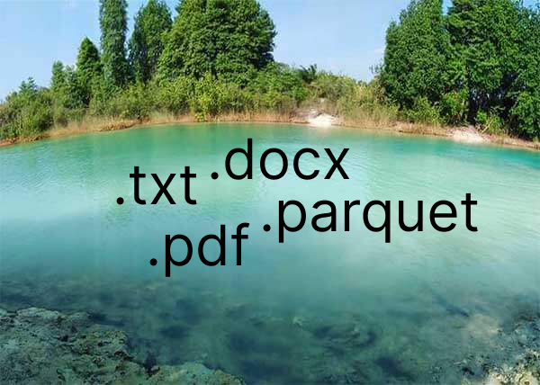
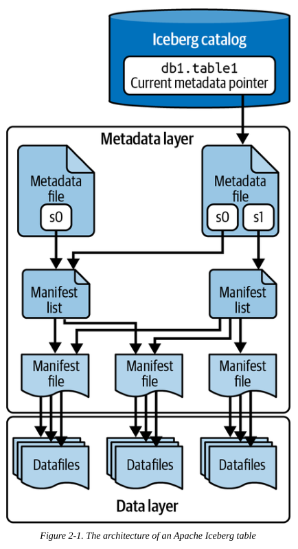

> Sumber utama Artikel ini adalah **Buku Apache Iceberg: The Definitive Guide** & **Lakehouse Whitepaper**

# Data Lakehouse is the new hype
Baru baru ini saya mendengar istilah _Data Lakehouse_, dan ternyata istilah ini memang cukup baru dikalangan para penggiat data, khususnya para _Data Engineer_.

_Data Lakehouse_ terdiri dari 2 istilah, yaitu _Data Lake_ dan _Data Warehouse_. _Data Lake_, seperti namanya, yaitu Danau Data, adalah tempat penyimpanan data berbiaya rendah yang dirancang untuk menangani data mentah dalam jumlah besar dalam format apa pun, termasuk data terstruktur, semi-terstruktur, dan tidak terstruktur (sumber: [Data Lake by IBM](https://www.ibm.com/id-id/think/topics/data-lake)), katakanlah kita bisa meng-upload seluruh tipe data apapun kedalam _Data Lake_, persis seperti folder pada laptop atau folder pada _Google Drive_.

Sedangkan _Data Warehouse_ merupakan sebuah database besar terpusat yang dirancang secara khusus untuk mendukung proses analisis dan pelaporan. Tidak seperti database operasional yang menangani transaksi harian secara real-time, data warehouse difokuskan pada pengumpulan, penyimpanan, dan analisis data historis dari berbagai sumber (sumber: [Data Warehouse by Telkom University](https://bds.telkomuniversity.ac.id/data-warehouse-pengertian-fungsi-dan-contohnya/)).

Kita tidak akan membahas Data Warehouse lebih dalam, sementara itu kita akan memabahas _Data Lake_ karena fokus dari Apache Iceberg ini adalah pada lingkungan & konsep _Data Lakehouse_ khusunya _Data Lake_.

<!-- ## Masalah Data Lake

## Solusi dari Apache Iceberg

Apache Iceberg merupakan sebuah program yang bertujuan untuk mengelola `data lake` yang tidak terstruktur menjadi sebuah `table format`

## Cara Kerja Apache Iceberg -->