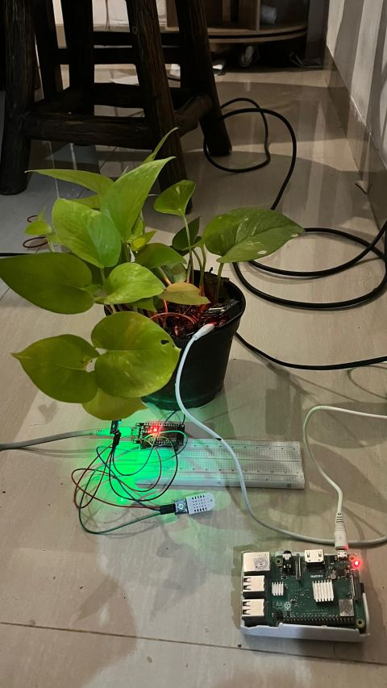
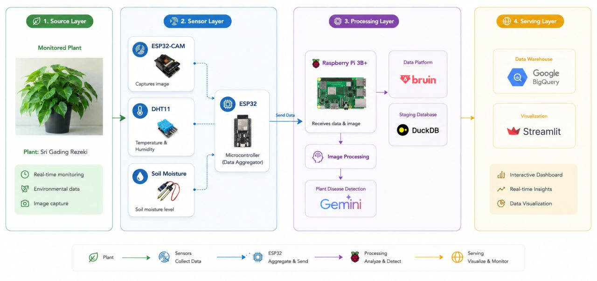
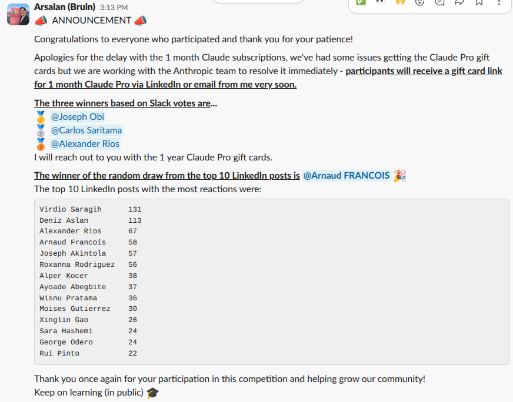

## Overview

An end-to-end Smart Plant Monitoring & Analysis System that continuously collects sensor data, captures plant images, analyzes plant health using AI, and delivers everything into a centralized analytics platform. Built with Bruin for data pipeline orchestration on a Raspberry Pi 3B edge device.

This project explores how modern data engineering practices can be applied beyond traditional business analytics into agriculture and environmental monitoring.

## Tech Stack

### IoT & Edge Devices
- **DHT22** - Temperature and humidity monitoring
- **Soil Moisture Sensor** - Measuring soil moisture levels
- **ESP32-CAM** - Capturing plant images
- **Raspberry Pi 3B (2017)** - Edge node and main local server

### Data Engineering
- **Bruin** - Data pipelines, ETL, workflow orchestration, and data transformations
- **DuckDB** - Local data processing and staging
- **BigQuery** - Cloud data warehouse using medallion architecture

### AI & Analytics
- **Google Gemini Vision** - Plant leaf health analysis and disease detection
- **Streamlit** - Dashboard visualization and monitoring
- **BMKG API** - Weather data integration for environmental context

## Key Features

- ETL orchestration with Bruin
- Data warehousing with medallion architecture (Bronze, Silver, Gold layers)
- IoT data ingestion pipelines
- AI-powered analytics for plant disease detection
- Cloud-native data platforms

## How It Works

The system collects sensor readings (temperature, humidity, soil moisture) and plant images from ESP32-CAM. Data flows through Bruin pipelines for transformation and is staged in DuckDB before loading into BigQuery. Google Gemini Vision analyzes plant leaf images for disease detection, with results visualized through a Streamlit dashboard enriched with BMKG weather data.

Ranked #1 by LinkedIn category for this project:

## Links

- [GitHub Repository](https://github.com/diosamuel/monitoring-iot-plant-disease-bruin)
- [LinkedIn Post](https://www.linkedin.com/feed/update/urn:li:activity:7467174090122887168/)