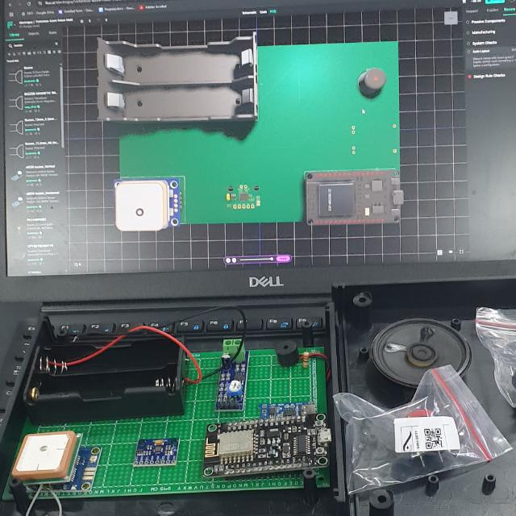

## Overview

We entered the Google APAC Challenge with big ambition, a rough plan, and a hardware-software hybrid built on the ITERA (Institut Teknologi Sumatera) campus in Lampung. The project combined IoT hardware with a web platform — and this is the story of the build, the submission, the disappointment, and a surprising encounter with one of the finalists in Jakarta.

## The Project

The idea was to build an end-to-end system spanning physical devices and the cloud:

### IoT Hardware
- **ESP32** — the main microcontroller powering the device
- **Battery** — portable power supply for field deployment
- **Speaker** — audio output for alerts and feedback
- **Push button** — user input trigger for the device
- **GPS block** — location capture for real-world positioning

### Software & Cloud
- **Frontend** — web interface for monitoring and interaction
- **Backend** — API server mediating between devices and the cloud
- **Google Cloud** — hosting and infrastructure tying the stack together

The combination of GPS + push-button input on the ESP32, with audio feedback through the speaker, gave the device a clear physical interaction loop. The web side surfaced that data for remote monitoring and control through a backend deployed on Google Cloud.

## The Challenge

The Google APAC Challenge pits teams across the Asia-Pacific region against a time-boxed problem. The pressure to ship a working solution, document your approach, and present it under tight deadlines is what makes it both exciting and brutal — and combining IoT hardware with a web stack made the integration surface area even larger.

## What Went Wrong

- **Scope creep** — we kept adding "one more feature" until the core became hard to demo
- **Last-minute integration** — the ESP32 firmware, backend, and frontend were built separately and didn't fit cleanly together at the end
- **Presentation over substance** — we polished the surface while the foundation cracked
- **Time management** — most of the critical bugs surfaced in the final hours, especially the hardware-software handoff

## The Surprise in Jakarta

A few weeks after the results came out, I ended up at an event in Jakarta and accidentally ran into one of the finalist teams. Talking to them made the failure click — not as a defeat, but as a checklist of what to fix before the next round.

## Lessons

- Ship the smallest thing that proves the idea, then stop
- Integrate early, integrate often — especially when hardware is involved
- A clean demo of a boring feature beats a broken demo of a flashy one
- Losing in public is uncomfortable but useful

## Featured Video

<iframe width="100%" height="400" src="https://www.youtube.com/embed/-4V-0kZZWis" title="YouTube video player" frameborder="0" allow="accelerometer; autoplay; clipboard-write; encrypted-media; gyroscope; picture-in-picture; web-share" allowfullscreen></iframe>

You can also watch it directly on YouTube: [Google APAC Challenge story](https://www.youtube.com/watch?v=-4V-0kZZWis).