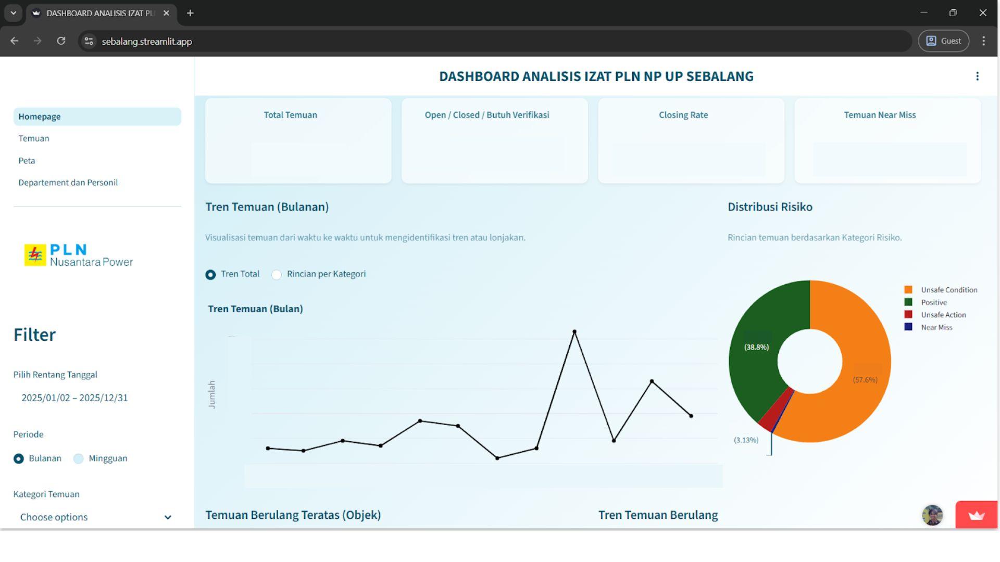

## Overview



A centralized data warehousing project designed to consolidate Health, Safety, Security, and Environment (HSSE) data across multiple operational sources. The goal is to transform fragmented incident reports, inspection records, and environmental measurements into a single source of truth, enabling real-time dashboards and data-driven safety decisions.

This project applies modern data engineering practices — medallion architecture, CI/CD-driven pipelines, and dimensional modeling — to solve an industrial analytics use case where timely and accurate HSSE reporting is critical.

## Motivation

HSSE teams typically struggle with:

- **Siloed data** spread across spreadsheets, paper forms, and legacy systems
- **Inconsistent metrics** between departments and field sites
- **Delayed reporting** due to manual aggregation workflows
- **Lack of historical trend analysis** for proactive risk management

This data warehouse addresses each of these problems by providing an automated, validated, and governable analytics foundation.

## Tech Stack

### Data Warehouse & Storage
- **Snowflake** - Cloud data warehouse with separate compute & storage scaling
- **Amazon S3** - External stage for raw file ingestion
- **dbt (data build tool)** - Transformations, testing, and documentation

### Data Modeling
- **Star Schema** - Fact and dimension tables following Kimball methodology
- **Medallion Architecture** - Bronze (raw), Silver (cleansed), Gold (marts)
- **Slowly Changing Dimensions (SCD Type 2)** - For tracking organizational changes

### Orchestration & Pipeline
- **Apache Airflow** - Pipeline scheduling and dependency management
- **Fivetran / custom connectors** - Source ingestion from operational systems
- **Great Expectations** - Data quality validation and profiling

### Analytics & Visualization
- **Looker** / **Tableau** - Executive dashboards and self-service reporting
- **Streamlit** - Ad-hoc exploration and operational monitoring views

## Architecture

```
[Sources: ERP, EHS system, Inspections app, IoT sensors]
        |
        v
   [Amazon S3 (Raw / Bronze)]
        |
        v
   [Snowflake Staging -> Silver (cleansed/conformed)]
        |
        v
   [dbt Transformations -> Gold (marts: incidents_f, inspections_f, env_metrics_f)]
        |
        v
   [Looker / Tableau Dashboards]
```

### Data Marts

1. **Incident Mart** — recordable incident counts, severity classification, root cause categories, days-away metrics
2. **Inspection Mart** — inspection completion rates, finding trends, overdue corrective actions
3. **Environmental Mart** — emissions, energy consumption, waste, water usage vs targets
4. **Leading Indicators Mart** — near-miss reports, safety observations, training completion

## Key Features

- **Automated ETL/ELT pipelines** orchestrated with Airflow, running on a defined schedule
- **Data quality gates** implemented with dbt tests and Great Expectations before publishing to marts
- **Consistent KPI definitions** version-controlled in dbt and documented in the warehouse
- **Lineage and impact analysis** through dbt documentation and Snowflake's object dependencies
- **Self-service analytics** empowering site managers to build reports without engineering intervention
- **Row-level security** ensuring sites only access their own operational data

## Outcome

The warehouse consolidates **5+ source systems** into a unified reporting layer, reducing monthly HSSE report generation time from **days of manual work to minutes**. Site leadership gained a near real-time view of safety performance, and the audit trail provided by dbt tests + Snowflake query history improved regulatory traceability.

## Lessons Learned

- **Source system buy-in matters more than tooling** — the hardest part was standardizing data entry formats across field sites.
- **Modeling for change** — using SCD Type 2 for organizational structure saved significant rework when sites restructured.
- **Data quality is a product, not a gate** — surfacing bad data through tests early built trust faster than blocking pipelines.

## Links

- (Repo / demo links to be added)