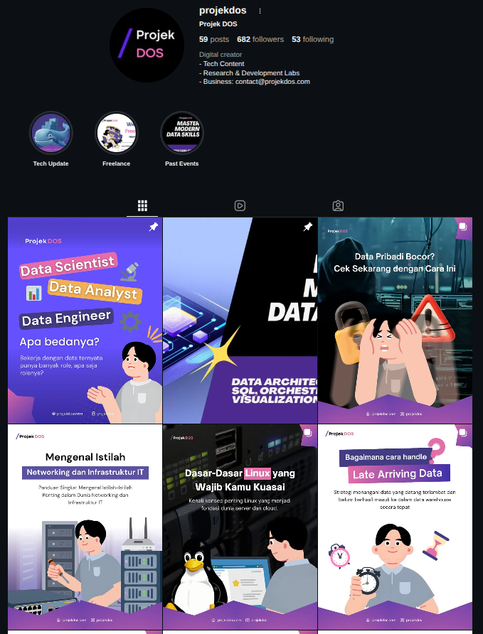

## Overview

[Projekdos](https://www.instagram.com/projekdos/) is a side-project Instagram channel focused on creating short-form, accessible educational content around data engineering, analytics, and modern data tooling. The goal is to break down complex concepts (pipelines, warehousing, modeling) into formats that fit the Instagram feed — carousels, reels, and quick visual explainers.

This project is a personal exploration of how technical knowledge can be made approachable through design and storytelling, instead of long-form articles.

## Motivation

Most people learning data engineering rely on long blog posts or paid courses. Instagram offered an underused channel to:

- Reach learners where they already spend their time
- Condense a concept into its essence without filler
- Build consistency through a visual identity

## Content Strategy

- **Carousels** — Static explainers covering one concept at a time (e.g. "What is a data mart?", "Medallion architecture in 5 slides")
- **Reels** — Quick walkthroughs and behind-the-pipeline moments
- **Stories** — Polls, Q&A, and interactive content to gauge what learners struggle with most
- **Captions** — Always include the takeaway up front; technical terms linked in bio

## Featured Post

A recent post from the channel:

<blockquote class="instagram-media" data-instgrm-captioned data-instgrm-permalink="https://www.instagram.com/projekdos/p/DZLsApkk_QO/" data-instgrm-version="14" style=" background:#FFF; border:0; border-radius:3px; box-shadow:0 0 1px 0 rgba(0,0,0,0.5),0 1px 10px 0 rgba(0,0,0,0.15); margin: 1px; max-width:540px; min-width:326px; padding:0; width:99.375%; width:-webkit-calc(100% - 2px); width:calc(100% - 2px);">
 <a href="https://www.instagram.com/projekdos/p/DZLsApkk_QO/" style=" background:#FFFFFF; line-height:0; padding:0 0; text-align:center; text-decoration:none; width:100%;" target="_blank"> 
 

 
 

 

 
<svg width="50px" height="50px" viewBox="0 0 60 60" version="1.1" xmlns="https://www.w3.org/2000/svg" xmlns:xlink="https://www.w3.org/1999/xlink"><g stroke="none" stroke-width="1" fill="none" fill-rule="evenodd"><g transform="translate(-511.000000, -20.000000)" fill="#000000"><g><path d="M556.869,30.41 C554.814,30.41 553.148,32.076 553.148,34.131 C553.148,36.186 554.814,37.852 556.869,37.852 C558.924,37.852 560.59,36.186 560.59,34.131 C560.59,32.076 558.924,30.41 556.869,30.41 M541,70.41 C541,70.41 544.586,67.79 551.063,67.79 C557.459,67.79 560.927,70.41 560.927,70.41 L560.927,73.41 L541,73.41 L541,70.41 Z M556.869,70.41 C554.814,70.41 553.148,72.076 553.148,74.131 C553.148,76.186 554.814,77.852 556.869,77.852 C558.924,77.852 560.59,76.186 560.59,74.131 C560.59,72.076 558.924,70.41 556.869,70.41 M541,30.41 C541,30.41 544.586,27.79 551.063,27.79 C557.459,27.79 560.927,30.41 560.927,30.41 L560.927,33.41 L541,33.41 L541,30.41 Z M556.869,30.41 C554.814,30.41 553.148,42.076 553.148,44.131 C553.148,46.186 554.814,47.852 556.869,47.852 C558.924,47.852 560.59,46.186 560.59,44.131 C560.59,42.076 558.924,30.41 556.869,30.41"></path></g></g></g></svg>

 
View this post on Instagram

 

 

 

 

 

 

 
 
A post shared by @projekdos

</a>
</blockquote>

If the embedded post above doesn't load, you can view it directly on Instagram: [@projekdos post](https://www.instagram.com/projekdos/p/DZLsApkk_QO/).

## Tools & Workflow

- **Canva / Figma** — Carousel design and template system
- **CapCut** — Short-form video editing for reels
- **Notion** — Content calendar and topic backlog
- **Later / Meta Business Suite** — Scheduling and analytics

## Links

- [Projekdos on Instagram](https://www.instagram.com/projekdos/)
- [Featured post](https://www.instagram.com/projekdos/p/DZLsApkk_QO/)