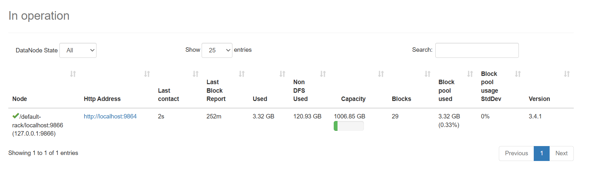
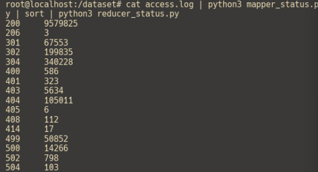
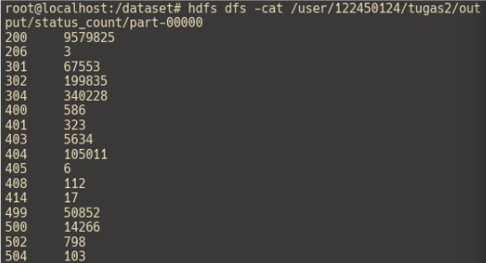

# Hands-on Hadoop HDFS & MapReduce (Streaming)

Catatan: ini tutorial untuk **demonstrasi** alur dasar Hadoop, khususnya:

- Menyimpan data besar di **HDFS**
- Memvalidasi file di HDFS dengan `fsck`
- Menjalankan **MapReduce** sederhana via **Hadoop Streaming** (Python)

## Prasyarat

- Hadoop sudah terpasang dan layanan HDFS sudah berjalan (single-node atau cluster)
- Perintah `hdfs` dan `hadoop` bisa dipanggil dari terminal
- Python 3 untuk `mapper` dan `reducer`

## Dataset

Dataset diunduh dari Kaggle / Internet Archive (NASA Kennedy Space Center):

- Sumber: [Kaggle - web-server-access-logs](https://www.kaggle.com/datasets/eliasdabbas/web-server-access-logs)
- Ukuran (compressed) kurang lebih 167 MB, sekitar 1.891.715 baris log HTTP
- Setelah diekstrak, file `access.log` bisa membengkak sampai ~3.5 GB

## 1) Membuat direktori di HDFS

Membuat direktori baru di **HDFS** menggunakan:

```bash
hdfs dfs -mkdir -p <nama-folder>
```
> `mkdir` = make directory

Pada contoh ini, kita pakai base path: `/user/tugas2`

### Folder input (raw)

```bash
hdfs dfs -mkdir -p /user/tugas2/raw
```

### Folder output

Membuat folder output:

```bash
hdfs dfs -mkdir -p /user/tugas2/output
```

## 2) Menempatkan file ke HDFS

Gunakan `put` untuk mengunggah `access.log` ke HDFS:

```bash
hdfs dfs -put access.log /user/tugas2/raw/
```

Opsional: pastikan file sudah masuk dengan:

```bash
hdfs dfs -ls -h /user/tugas2/raw/
```

## 3) `fsck` health check

Untuk melihat file, blok, dan lokasi blok:

```bash
hdfs fsck /user/tugas2/raw -files -blocks -locations
```

## Review
1. Analisis hasil fsck: berapa jumlah blok yang terbentuk? Apakah sesuai dengan ukuran file dan ukuran blok default HDFS (128 MB)?

Jika file sekitar 3.5 GB dan block size 128 MB, jumlah blok akan berada di kisaran ~27–28 blok (tergantung ukuran file dan konfigurasi).
Contoh: jika file sekitar 3.5 GB dan ukuran blok 128 MB, jumlah blok akan berada di kisaran ~27–28 blok (tergantung ukuran file dan konfigurasi).

2. Screenshot NameNode



3. Apa yang dimaksud dengan replication factor dan mengapa pada single-node cluster nilainya efektif hanya 1?

Replication factor adalah jumlah salinan dari setiap blok data yang disimpan pada beberapa DataNode di dalam klaster.

Pada single-node cluster, nilai replication factor **efektif** adalah 1. Hal ini terjadi karena klaster hanya memiliki satu DataNode, sehingga tidak ada node lain yang dapat menyimpan replika tambahan.

## 4) MapReduce sederhana: hitung jumlah kode status HTTP

Di bagian ini kita akan menghitung berapa kali setiap kode status HTTP muncul (misalnya `200`, `404`, `500`) dari file log.

### Mapper (`mapper_status.py`)

Mapper akan membaca setiap baris log, mengambil **status code**, lalu mengeluarkan pasangan key-value dengan pemisah **tab**:

- Output format: `<status_code>\t1`

Simpan sebagai `mapper_status.py`:

```python
#!/usr/bin/env python3
import sys

for line in sys.stdin:
    line = line.strip()
    try:
        # Split berdasarkan tanda kutip untuk memisahkan bagian request dan response
        parts = line.split('"')
        # parts [2] mengandung ’ 200 6245 ’ -- status code ada di posisi pertama
        if len(parts) >= 3:
            status = parts[2].strip().split()[0]
            print(f"{ status }\t1")
    except (IndexError,ValueError):
        pass # Abaikan baris yang tidak sesuai format CLF
```

### Reducer (`reducer.py`)

Reducer menjumlahkan semua `1` untuk setiap status code (hasil dari mapper).

Simpan sebagai `reducer.py`:

```python
import sys
current_key = None
current_count = 0

for line in sys.stdin:
    line = line.strip()
    key,value = line.split('\t', 1)
    value = int(value)
    if current_key == key:
        current_count += value
    else:
        if current_key is not None:
            print(f"{current_key}\t{current_count}")
        current_key = key
        current_count = value

if current_key is not None:
    print(f"{current_key}\t{current_count}")
```

### Jalankan secara lokal (sanity check)

Penting: output dari mapper **harus di-sort berdasarkan key** sebelum masuk ke reducer.

```bash
cat access.log | python3 mapper_status.py | sort | python3 reducer.py
```

Output akan berisi pasangan `<status>\t<count>`.



| Status | Count |
|-------:|------:|
| 200 | 9579825 |
| 206 | 3 |
| 301 | 67553 |
| 302 | 199835 |
| 304 | 340228 |
| 400 | 586 |
| 401 | 323 |
| 403 | 5634 |
| 404 | 105011 |
| 405 | 6 |
| 408 | 112 |
| 414 | 17 |
| 499 | 50852 |
| 500 | 14266 |
| 502 | 798 |
| 504 | 103 |
### Jalankan dengan Hadoop Streaming

Selain menjalankan manual, kita bisa menggunakan Hadoop sebagai runner (Hadoop Streaming):

```bash
hadoop jar $HADOOP_HOME/share/hadoop/tools/lib/hadoop-streaming-*.jar \
  -files mapper_status.py,reducer.py \
  -mapper "python3 mapper_status.py" \
  -reducer "python3 reducer.py" \
  -input /user/tugas2/raw/ \
  -output /user/tugas2/output/status_count
```

Catatan: folder output harus **belum ada**. Jika sudah ada dari run sebelumnya, hapus dulu:

```bash
hdfs dfs -rm -r /user/tugas2/output/status_count
```

Jika job sudah selesai, lihat hasilnya:

```bash
hdfs dfs -cat /user/tugas2/output/status_count/part-00000
```

Untuk melihat output dari operasi MapReduce menggunakan Hadoop:



| Status | Count |
|-------:|------:|
| 200 | 9579825 |
| 206 | 3 |
| 301 | 67553 |
| 302 | 199835 |
| 304 | 340228 |
| 400 | 586 |
| 401 | 323 |
| 403 | 5634 |
| 404 | 105011 |
| 405 | 6 |
| 408 | 112 |
| 414 | 17 |
| 499 | 50852 |
| 500 | 14266 |
| 502 | 798 |
| 504 | 103 |

Hasilnya akan sama konsepnya seperti MapReduce lokal sebelumnya, hanya saja pemrosesannya dilakukan oleh Hadoop (lebih relevan untuk data yang besar dan terdistribusi).

## 5) MapReduce dengan data URL (link)

Contoh ini mengganti data percobaan dari **kode status HTTP** menjadi **URL request** (misalnya `/images/logo.png`) lalu menghitung total kemunculannya.

### Mapper (`mapper_link.py`)

Mapper mengekstrak URL dari request line, membersihkan query string, lalu mengeluarkan:

- Output format: `<url>\t1`

Simpan sebagai `mapper_link.py`:

```python
#!/usr/bin/env python3
import re
import sys
import urllib.parse

for line in sys.stdin:
    line = line.strip()
    match = re.search(r'"(GET|POST|PUT|DELETE) (.*?) HTTP', line)
    if not match:
        continue

    url = match.group(2)
    url = urllib.parse.unquote(url)
    url = url.split("?", 1)[0]
    print(f"{url}\t1")
```

### Reducer (`reducer_link.py`)

Reducer menggabungkan output mapper sehingga kita dapat total request untuk URL yang sama.

Simpan sebagai `reducer_link.py`:

```python
#!/usr/bin/env python3
import sys

current_url = None
count = 0

for line in sys.stdin:
    url, value = line.strip().split("\t", 1)
    value = int(value)

    if current_url == url:
        count += value
    else:
        if current_url is not None:
            print(f"{current_url}\t{count}")
        current_url = url
        count = value

if current_url is not None:
    print(f"{current_url}\t{count}")
```

### Jalankan dengan Hadoop Streaming

Jalankan menggunakan Hadoop Streaming (menggunakan input yang sama di HDFS):

```bash
hadoop jar $HADOOP_HOME/share/hadoop/tools/lib/hadoop-streaming-*.jar \
  -files mapper_link.py,reducer_link.py \
  -mapper "python3 mapper_link.py" \
  -reducer "python3 reducer_link.py" \
  -input /user/tugas2/raw/ \
  -output /user/tugas2/output/url_count
```

Jika output sudah ada dari run sebelumnya, hapus dulu:

```bash
hdfs dfs -rm -r /user/tugas2/output/url_count
```

### Lihat top 10 URL paling sering dikunjungi

```bash
hdfs dfs -cat /user/tugas2/output/url_count/part-00000 | sort -t$'\t' -k2,2nr | head -10 | tee url_count_top10.txt
```

| URL | Count |
|-----|------:|
| /settings/logo | 352037 |
| /static/css/font/wyekan/font.woff | 280176 |
| /rapidGrails/jsonList | 196912 |
| /static/images/guarantees/bestPrice.png | 138010 |
| /static/images/guarantees/fastDelivery.png | 125689 |
| /static/images/guarantees/warranty.png | 124127 |
| /static/images/guarantees/goodShopping.png | 116653 |
| /site/alexaGooleAnalitic | 103785 |
| /favicon.ico | 102815 |