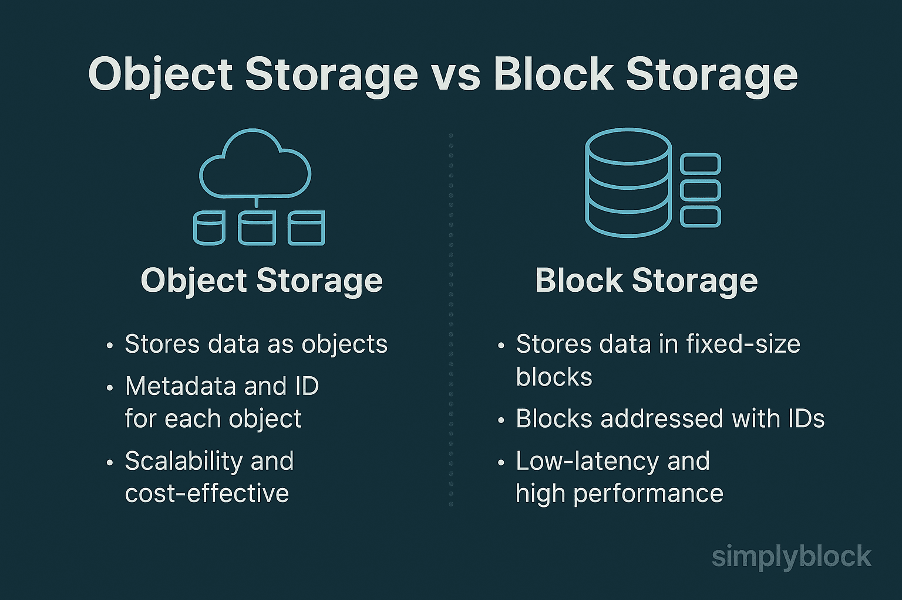

> source: https://www.min.io/learn/open-table-format

Data lakehouse was stored their data in some object storage like s3, very different from data warehouse that store the data in some rdbms like postgresql. Data lakehouse is designed for unstructured and semi structured data, most likely are not supported in relational database like postgresql, or mysql if you want.

The solution was, the file is store in object storage, and their metadata are stored as a parquet file, if you dont know what is apache parquet file, i gonna create article later that discuss about parquet file.

Illustration of Object Storage vs Block Storage

Object storage are cheap storage, think like folder in local computer, but you actually can get it with http/https API. Object storage is a unique take on storing data. Instead of keeping files in a neat folder structure such as a traditional filesystem, object storage tosses everything into what are called buckets. Each file becomes an object and gets a bunch of metadata tagged along with it. This metadata tells us all sorts of things about the file; enabling improved concurrency and resiliency
when using object storage as the underlying files can be replicated for regional access or concurrency while all users just interact with it as a simple object (Apache Iceberg: The Definitive Guide)

<!-- The problem is, you cant query on S3, indeed S3  -->